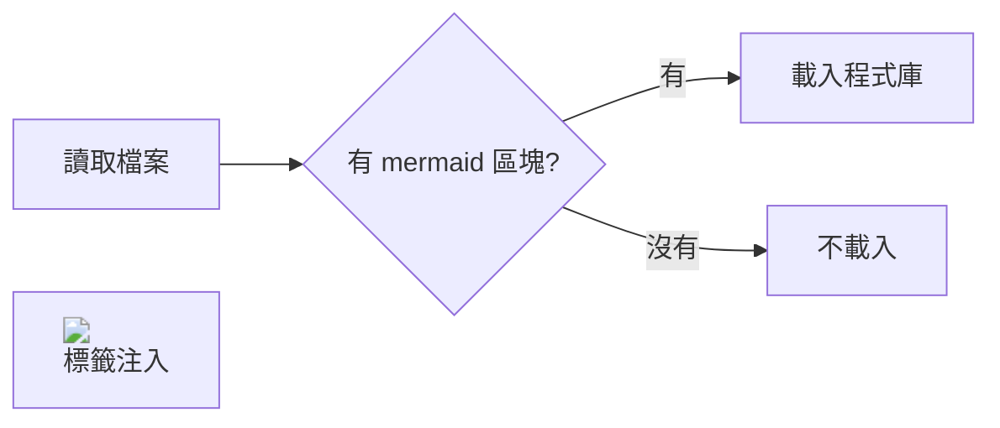
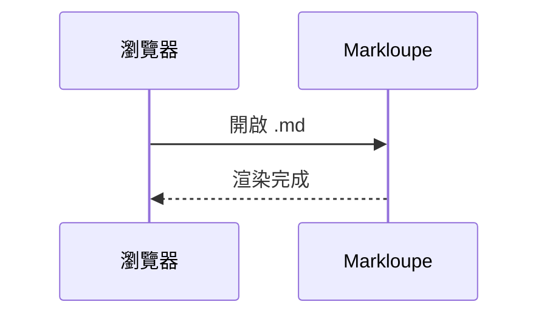

# Mermaid 測試


```mermaid
flowchart LR
  A[讀取檔案] --> B{有 mermaid 區塊?}
  B -->|有| C[載入程式庫]
  B -->|沒有| D[不載入]
  E["<img src=x onerror=document.body.dataset.xss=9>標籤注入"]
  click A call alert()
```


```mermaid
sequenceDiagram
  瀏覽器->>Markloupe: 開啟 .md
  Markloupe-->>瀏覽器: 渲染完成
```

```mermaid
flowchart TD
  A[未關閉的括號 --> B
```

一般程式碼區塊不受影響：

```js
const x = 1
```
